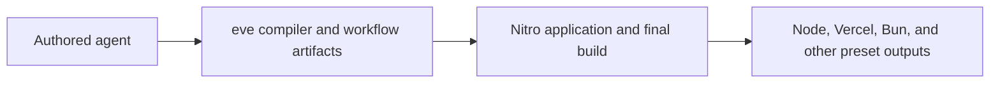

# Nitro-first host integration

## Decision

eve will keep Nitro as its core host and deployment dependency. The removal
prototype proved useful ownership and correctness improvements, but its install
size reduction came from physically removing Nitro's umbrella dependency graph,
not from a faster router or runtime. Reproducing that graph win while retaining
the current `nitro` package is impossible; it requires an upstream package
split.

The current integration should instead make the ownership boundary explicit:

eve owns source discovery, transforms, generated channel handlers, workflow
artifacts, and the application-specific configuration passed to Nitro. Nitro
owns the final server graph, route grammar, presets, platform emission, error
handling, development runtime, and automatic nf3 native dependency tracing.

## Changes carried forward

The prototype exposed several improvements that do not require replacing
Nitro:

- eve-owned source transforms and helper bundles use a direct, exact Rolldown
  dependency instead of resolving a private copy from Nitro's installation.
  The version is aligned with Nitro and Vite in the current workspace so this
  does not add another native binding version.
- Custom Rolldown condition names contain only eve-specific additions. Standard
  `import`, `require`, `node`, `browser`, and `default` conditions remain
  per-edge decisions, preserving conditional exports used by CommonJS parents.
- Workflow wrappers are generated directly from one intermediate bundle. They
  no longer depend on reparsing and rewriting generated JavaScript, and they
  retain inline source maps.
- A Nitro runtime guard rejects upgrades resolved to ordinary HTTP routes, and
  one generated handler can serve both `GET` and `WEBSOCKET` on the same path.
  These are compatibility layers around current upstream WebSocket routing.
- Development workers request graceful shutdown before bounded termination, so
  application IPC close hooks run.
- Production builds skip Nitro public-asset and prerender phases because eve
  configures neither, while retaining Nitro's `prepare` and final `build`.
- Workspace consumers rely on Turbo's dependency graph instead of starting a
  nested eve build that can race the package's destructive `dist` rebuild.
- Bundler warning suppression now hides a warning only when every referenced
  file belongs to dependencies or compiled vendor output; mixed authored and
  dependency warnings remain visible.
- The vendored OpenTelemetry API bundle resolves bare imports to the CommonJS
  entry used by `@vercel/otel`, preserving the process-wide API singleton.

## Nitro behavior deliberately retained

The direct-host prototype also identified responsibilities that should stay
with Nitro:

- automatic nf3 classification and tracing of native dependencies;
- Nitro's full route grammar and preset-specific routing behavior;
- Vercel Build Output generation and ongoing provider changes;
- Bun and other non-Node preset support;
- Nitro/H3 error rendering, request context, host and port conventions, and
  source-map behavior;
- development build and listener lifecycle outside the narrow eve worker
  shutdown adapter.

Duplicating those surfaces in eve would create a second host framework and make
provider parity eve's responsibility.

## Required upstream shape

The remaining dependency and ownership problems need upstream contracts rather
than more private configuration mutation. The highest-value change is a
physically independent `nitro-core` package with a substantially smaller
dependency graph. It must be installable without storage, database, cache, CLI,
development, and unused provider integrations; export maps alone do not reduce
package-manager resolution or installation.

Useful follow-on boundaries are:

1. A caller-owned final Rolldown invocation or complete public configuration
   hook, so application plugins do not depend on Nitro's internal hook order.
2. An independently consumable nf3 classifier and tracer that preserves
   automatic native dependency detection.
3. Pure platform emitters that accept a built application graph, especially
   for Vercel output.
4. A disposable Node development host with explicit drain and close semantics.
5. First-class HTTP-plus-WebSocket route registration and strict rejection of
   unmatched upgrades.

Until those exist, eve should prefer small, tested compatibility adapters and
otherwise lean on Nitro's public behavior. No install-time or runtime
performance improvement is claimed from this integration work; the earlier
install measurements apply only to the removal prototype's smaller physical
package graph.
