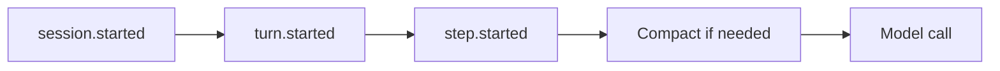

# Role-aware instructions

## Summary

Replace the system-only `{ markdown }` instructions API with role-aware
`{ content, role? }` definitions. System-role instructions stay outside model
history and are re-applied after compaction or a manual clear. User-role
instructions enter ordinary durable history, so they preserve an existing
prompt prefix but may later be summarized or removed.

At the same time, give hooks and dynamic capability resolvers for instructions,
tools, skills, and subagents the same exact history snapshot and session context
at each existing lifecycle boundary.

## Authoring API

```ts
type InstructionsDefinition =
  | { content: string; role?: "system" | "user"; markdown?: never }
  | {
      /** @deprecated Use content. */
      markdown: string;
      content?: never;
      role?: never;
    };
```

`role` defaults to `system`. Markdown files and the deprecated object shape
always produce system-role instructions. User-role instructions require a
TypeScript module.

Use `role` rather than `scope` or `type`: the value selects the model-message
role, while scope already describes the session, turn, or step lifecycle.

```ts
export default defineInstructions({
  content: JSON.stringify(profile),
  role: "user",
});
```

## Semantics

| Definition     | Materialization                  | Lifetime                                                                                                 |
| -------------- | -------------------------------- | -------------------------------------------------------------------------------------------------------- |
| Static system  | Session system prompt            | Refreshed from the deployed agent; unaffected by history compaction or clear                             |
| Static user    | First durable history entry      | Seeded once at session creation; never re-seeded on hydration or deployment refresh                      |
| Dynamic system | System message outside history   | Session and turn values are durable; step values are live; narrower scopes shadow the same resolver slug |
| Dynamic user   | User message appended to history | Appended once when the matching session, turn, or step event is accepted                                 |

Blank content contributes nothing. A step resolver returning `null`, blank
content, or user-role content suppresses a wider system result from the same
resolver for that step. Resolver failures log and fall back to the last valid
wider scope.

User-role instructions are ordinary history after insertion: manual clear can
remove them, compaction can summarize or discard them, and they are not
restored. Their append-only placement preserves the existing prompt prefix but
does not guarantee a provider cache hit. Changing system-role instructions or
the selected model can invalidate the cache prefix.

## Lifecycle contract



Dynamic event subsets are compiler-validated:

- tools and instructions: `session.started`, `turn.started`, `step.started`;
- skills and subagents: `session.started`, `turn.started`.

This proposal does not change dynamic model selection events or ordering.

Hooks receive the accepted stamped event, while dynamic capability resolvers
retain their existing event values. Both receive the same callback context:
session identity/auth/turn, agent and channel metadata, `abortSignal`, sandbox
and skill access, and the model-history snapshot at that event boundary. Dynamic
model selection retains its existing model-specific callback context.

## Compatibility and surfaces

The deprecated `{ markdown }` shape remains source-compatible but inspection
and compiled artifacts expose arrays of `{ content, role, ...source }` entries.
The discovery manifest, compiled manifest, `/eve/v1/info`, and Vercel agent
summary contracts each advance their version. Hook and dynamic capability
extension contracts advance for the expanded callback context; the stream
protocol does not change.

The change includes unit coverage for normalization, prompt composition,
single-seed persistence, scope precedence, event validation, and protocol
construction; integration/scenario coverage verifies discovery, compilation,
inspection, lifecycle ordering, and compaction boundaries.
