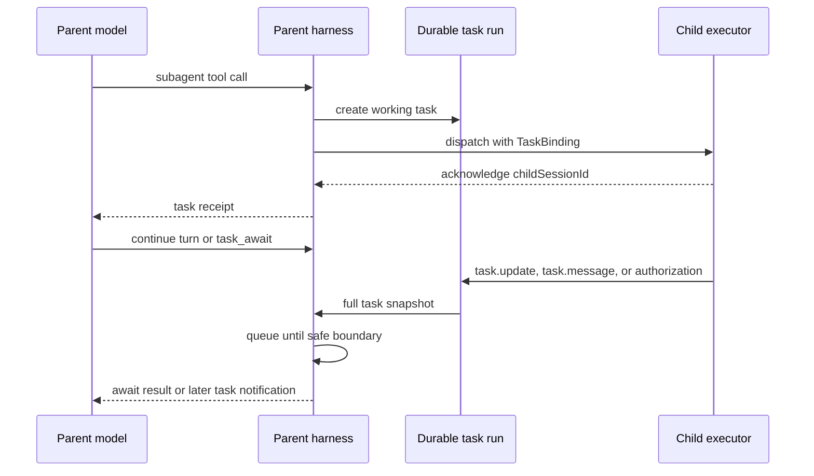

# Subagents as tasks

## Summary

Under an opt-in `experimental.tasks` mode, eve should represent long-running work as durable,
addressable tasks. This plan applies that model only to local and remote subagents. A subagent call
returns a task receipt after dispatch instead of keeping the parent turn blocked until the child
finishes. The parent can inspect, await, message, or cancel the task with framework-owned tools,
and the child can intentionally report progress to its parent with one framework-owned tool.

Without the flag, current tool and subagent behavior must remain unchanged.

This draft is based on the [Tools as Tasks proposal], the earlier background-task plan in
[PR #1085], and the storage-boundary findings from the closed [PR #1190] implementation spike.

## Current behavior

Authored tools expose `execute(input, ctx)`. Subagents are different: eve lowers them to
execute-less tools carrying `runtimeAction` metadata, then handles them after the model step
outside the authored tool API. The split is visible in the current
[`ToolDefinition` contract] and [`createNodeHarnessTools` lowering].

The harness first lets the AI SDK run ordinary tool calls. It then collects subagent tool calls
into a pending runtime-action batch. The turn workflow dispatches that batch and waits for all
results before starting the next model step. See the [runtime-action park path], the
[serial dispatch loop], and the [turn-level wait]. The dispatch loop starts children one by one;
once started, their runs proceed independently. The parent still waits for the whole batch.

Local and remote children also have different communication paths:

| Flow                              | Local child today                      | Remote child today                                                  |
| --------------------------------- | -------------------------------------- | ------------------------------------------------------------------- |
| Terminal result or failure        | Resumes the parent turn hook           | Posts `session.completed` or `session.failed` to the callback route |
| Input request, including approval | Forwarded by the subagent adapter      | No callback shape                                                   |
| Authorization event               | Forwarded by the subagent adapter      | No callback shape                                                   |
| Input response                    | Routed to the child continuation token | No callback shape                                                   |
| Cancellation                      | Descendant cancellation                | Remote `cancel-turn` request                                        |

The [local subagent adapter] forwards input and authorization events to an active parent turn.
The [remote callback route] accepts only terminal completion and failure. This is why progress
and human input cannot be added cleanly as channel-only behavior: the parent harness and remote
transport do not share a non-terminal child protocol. Current input responses use
[child response routing], while [descendant cancellation] selects separate local and remote
cancel paths.

## Goals

- Let a parent continue its turn while delegated work runs.
- Give the model explicit task controls instead of making every wait implicit.
- Let a child intentionally report progress to its parent instead of leaving progress to
  channel-layer guesswork.
- Carry progress, input requests, authorization events, results, failures, and cancellation over
  one local and remote task contract.
- Keep task state durable across turns and replay.
- Preserve provider-valid history. The originating tool call receives exactly one result.
- Keep authored subagent files unchanged.
- Give local and remote subagents the same externally visible lifecycle.
- Align task status and control semantics with the MCP Tasks extension where the contracts match.

## Non-goals

- Exposing an MCP Tasks server or client endpoint in this work.
- Changing authored tools, built-in tools, connections, skills, or dynamic workflows.
- Replacing `runtimeAction` lowering with a new public `defineTool` API.
- Rolling back external side effects after cancellation.
- Retrying failed subagent work automatically.
- Streaming every progress event into model context.
- Sharing task handles across parent sessions.

## Terminology

A **task** is one unit of work with a durable identity and lifecycle. A task is not an agent
session. Terminal tasks never restart.

A **child session** is the resumable conversation owned by a delegated agent. A follow-up sent to
the same child session creates a new task bound to the same `childSessionId`. This matches A2A's
separation between immutable tasks and a longer-lived [`contextId`].

A **runtime action** is today's framework-internal dispatch mechanism behind execute-less tools
such as subagent calls. This plan changes how the runtime executes the two subagent kinds, not
how authored files lower to them.

A **synchronous invocation** runs inside the current harness step. Its result may trigger another
model step in the same turn.

A **background task** is owned by the parent session, not the originating turn. It may complete,
request input, or emit progress after that turn ends.

**Delegated execution** is a runtime execution mode, not a tool-authoring surface. A delegated
dispatch returns once the executor acknowledges the work; the task stays `working`, and every
later transition arrives over the task wire.

`completed`, `failed`, and `cancelled` are terminal statuses. `input_required` is not terminal,
but it is ready for parent action. `task_await` must return for either condition so a parent never
deadlocks while its child waits for input.

## Authoring contract

The root agent opts in:

```ts
export default defineAgent({
  experimental: {
    tasks: true,
  },
});
```

The flag changes only local and remote subagent calls. Every such call runs in background mode.
All other tools keep their current behavior.

The parent receives these framework-owned tools:

```ts
interface TaskParentTools {
  task_cancel(input: { taskIds: string[] }): Promise<TaskToolResult<boolean>>;
  task_peek(input: { taskIds: string[] }): Promise<TaskToolResult<TaskView[]>>;
  task_send(input: { taskId: string; input: unknown }): Promise<TaskToolResult<TaskView>>;
  task_await(input: { taskIds: string[] }): Promise<TaskToolResult<TaskView[]>>;
  task_sleep(input: { durationMs: number }): Promise<TaskToolResult<boolean>>;
}
```

The exact `TaskToolResult` error shape and `task_send.input` union remain open. Before
implementation, `task_send.input` should become a discriminated eve-owned type that separates an
`InputResponse[]` batch from an arbitrary child message.

The controls have distinct behavior:

- `task_peek` reads current state without blocking and does not return credentials or routing
  handles.
- `task_await` durably pauses the current turn until every selected task is terminal or
  `input_required`. An already-ready task returns immediately.
- `task_send` answers an `input_required` task or sends a follow-up message to the addressed child
  session. A message sent after the prior task became terminal creates a new task bound to the
  same child session; it never reopens the terminal task.
- `task_cancel` requests cooperative cancellation. A committed terminal state is final, so a late
  child result cannot revive a cancelled task.
- `task_sleep` durably pauses the current turn for paced checks. It does not poll or mutate a task.

### Child task tools

A child session dispatched as a task receives one framework-owned tool:

```ts
interface TaskChildTools {
  task_message(input: { message: string }): Promise<TaskToolResult<boolean>>;
}
```

`task_message` emits a `task.message` event through the task binding and updates the task's
durable `statusMessage`. It returns after the update is durably recorded. It does not change the
child's lifecycle and is not a substitute for the terminal result.

No child-facing surface exists today: child-to-parent communication is entirely harness-level.
The [local subagent adapter] forwards events as side effects the child model never sees, and the
[remote callback route] accepts only terminal payloads. This tool is the model-facing half of the
proposal's original motivation — letting a child report progress on purpose rather than having
channels infer it.

### Task view

```ts
type TaskStatus = "working" | "input_required" | "completed" | "failed" | "cancelled";

interface TaskView {
  readonly taskId: string;
  readonly status: TaskStatus;
  readonly statusMessage?: string;
  readonly metadata: TaskMetadata;
  readonly lastOutput?: TaskOutput;
}

interface TaskMetadata {
  readonly kind: "subagent";
  readonly mode: "local" | "remote";
  readonly name: string;
  readonly childSessionId: string;
  readonly url: string;
}

type TaskOutput =
  | { readonly type: "result"; readonly data: JsonValue }
  | { readonly type: "error"; readonly data: JsonValue };
```

When `status` is `input_required`, the view must also expose the outstanding `InputRequest[]`.
Whether that becomes a discriminated `TaskView` variant or a status-specific field is an API
decision, not an implementation detail.

Task IDs are minted identifiers. They are never child session IDs, continuation tokens, callback
tokens, or authorization capabilities. A parent session owns many tasks, and lookup verifies both
the parent `sessionId` and `taskId`.

### Original call result

After durable task creation and child-dispatch acknowledgement, the originating subagent call
gets one receipt:

```json
{
  "taskId": "task_01K...",
  "status": "working"
}
```

The eventual child result must not become a second result for that call. It reaches the model
through `task_await`, `task_peek`, or a later framework-authored task notification. This keeps
history append-only and leaves no dangling provider tool call.

## Task state and ownership

The mutable task record should live in a dedicated durable task run. That run is the single writer
for lifecycle transitions and appends a full `TaskView` snapshot after each accepted command.
Other paths submit commands to that run and read its snapshots.

The parent session stores only a live-task index:

```ts
interface SessionTaskIndexEntry {
  readonly taskId: string;
  readonly taskRunId: string;
}
```

This changes one sentence in the Notion proposal, which places the record directly in durable
session state. The [PR #1190] spike found that boundary unworkable: session state is threaded
through step results, while callback routes and child executors need to update task state without
holding the current session snapshot. A task-owned run also serializes competing completion,
cancellation, and input-response transitions.

The lifecycle rules are:

```text
working <-> input_required
   |             |
   +-----> completed
   +-----> failed
   +-----> cancelled

completed, failed, and cancelled are final
```

- A background task survives turn completion and turn cancellation.
- It ends when it completes, fails, is cancelled, or its parent session ends.
- Parent-session finalization cooperatively cancels every live task before completing.
- Task cancellation commits the `cancelled` state before propagating the executor abort.
- Replayed creation for the same parent session and tool-call ID returns the same task and must not
  dispatch duplicate work.

## Delegated execution

Today the runtime parks subagent tool calls, dispatches them serially as a batch after the
synchronous calls, and holds the turn until every action in the batch resolves (the
[runtime-action park path], [serial dispatch loop], and [turn-level wait]). Delegated execution
replaces the park-and-wait mechanism in the same dispatch codepath:

1. The harness creates a durable `working` task for the subagent call.
2. It dispatches the child with the task binding.
3. The child acknowledges its `childSessionId`, which is persisted immediately.
4. The originating call receives its receipt and the turn continues.

Everything after acknowledgement — progress, input requests, authorization, terminal outcome —
arrives over the task wire instead of resolving the dispatch. Delegated execution is an agent
runtime change, not a `defineTool` change: authored tool contracts and the `runtimeAction`
lowering stay as they are, and the mode lands inert until the experiment selects the two subagent
kinds into it. A later phase can expose delegation to authored tools on top of the same mode.

## Parent and executor wire contract

The parent-facing half of a task binding is passed to a local or remote child executor. Routing
credentials never enter model-visible context, history, task events, or compaction summaries.

```ts
interface TaskBinding {
  readonly taskId: string;
  readonly token: string;
  readonly url: string;
}

interface TaskExecutorBinding {
  readonly childSessionId: string;
  readonly inbound: { readonly url: string; readonly token: string };
}

type ParentInbound =
  | { readonly type: "task.update"; readonly task: TaskView }
  | { readonly type: "task.message"; readonly taskId: string; readonly message: JsonValue }
  | { readonly type: "task.authorization"; readonly taskId: string; readonly data: JsonValue };
```

An `input_required` transition carries the full outstanding request batch in its task snapshot.
The parent emits those requests through the normal `input.requested` stream contract. Matching
responses route back through `task_send`. Authorization uses the same task binding but remains a
distinct event because it has different disclosure rules.

The five flows that split across two transports today all converge on this one contract, for
local and remote children alike:

| Flow                              | Over the task wire                                            |
| --------------------------------- | ------------------------------------------------------------- |
| Terminal result or failure        | `task.update` with a terminal snapshot                        |
| Input request, including approval | `task.update` with `input_required` and the outstanding batch |
| Authorization event               | `task.authorization`                                          |
| Input response                    | `task_send` addressed to the owning task                      |
| Cancellation                      | `task_cancel`, committed then propagated to the executor      |

Progress is the sixth flow, new in this plan: `task.message` from the child's `task_message`
tool, durably recorded as the task's latest `statusMessage`.

The proposed routing policy makes terminal updates and `input_required` wake a parked parent
session. Progress updates change task state and emit client-visible lifecycle events, but do not
start a model turn on their own. During an active turn, inbound task events wait for the next safe
step boundary. They never interrupt an active model call.



### Agent-to-agent dependency

This plan depends on the session-addressing route and authentication envelope from the first
phase of the [agent2agent communication proposal]. Tasks and agent handles must not collapse into
one record:

- the task identifies the current unit of work;
- the handle identifies the reusable child session;
- the task's private `TaskExecutorBinding` lets `task_send` address in-flight work;
- resuming that child creates a new task bound to the same handle.

The A2A draft currently records a handle after the child's first result. That is too late for
`task_send` during `working` or `input_required`. Task dispatch must persist the private executor
binding as soon as the child acknowledges its session. The same acknowledgement may create or
update the reusable agent handle. Both records may reuse the A2A inbox route, but routing tokens
belong in one shared credential store rather than two independent session-addressing mechanisms.

## MCP alignment

The current [MCP Tasks extension] provides the closest standard vocabulary:

- `working`, `input_required`, `completed`, `failed`, and `cancelled` statuses;
- a durable task handle returned instead of a final tool result;
- `tasks/get`, `tasks/update`, and `tasks/cancel` operations;
- full task snapshots in `notifications/tasks`;
- terminal states that do not change.

eve's `task_peek`, `task_send`, and `task_cancel` map to those operations. `task_await` and
`task_sleep` are eve controls, not MCP methods. eve is not implementing the MCP wire protocol in
this work.

One semantic difference needs an explicit decision. MCP treats a tool-level `isError: true`
result as `completed`; `failed` is reserved for JSON-RPC execution failure. This draft's
`TaskOutput` has separate `result` and `error` variants. The implementation must either adopt the
MCP distinction or state why eve uses a different failure taxonomy.

Cancellation also differs. MCP `tasks/cancel` acknowledges intent and allows the task to finish in
a non-cancelled state. This draft commits `cancelled` before propagating abort and discards late
results. That stronger guarantee is useful for model reasoning, but it is an eve semantic rather
than MCP compatibility.

## Delivery

1. Land the task foundation inert: types, transition rules, durable task run, session index, and
   the parent and child task tools, all undiscoverable without the experiment.
2. Land delegated execution in the runtime, inert: dispatch acknowledges, the task stays
   `working`, and nothing selects the mode yet.
3. Land the A2A handle and inbox dependency needed to address an existing child session.
4. Behind `experimental.tasks`, run subagent runtime actions as tasks: create the task in the
   runtime-action dispatch codepath, return its receipt, and dispatch the child with a task
   binding.
5. Carry all six child flows over the task wire: terminal outcome, input request, authorization,
   input response, cancellation, and progress.
6. Normalize local and remote subagents onto the same delegated execution path while preserving
   their authored definitions.
7. Make tasks the default subagent execution path and retire the flag once the acceptance
   criteria hold.

## Acceptance criteria

- With `experimental.tasks` absent or false, existing tool results, events, cancellation, and
  subagent blocking behavior do not change.
- With it enabled, a slow subagent returns a task receipt and the parent can take another model
  step before the child completes.
- The original tool call has exactly one result in durable history. Later task output cannot be
  attached to that call a second time.
- Local and remote subagents support the same six parent-child flows.
- A child dispatched as a task can call `task_message`; the parent observes the durable latest
  message through `task_peek` without a model turn starting on its own.
- `task_await` returns on terminal status and `input_required`, including when the task was already
  ready before the call.
- `task_peek` observes current state without waking or mutating the executor.
- `task_send` routes each response or message to the intended child session and cannot cross
  parent-session ownership.
- Cancellation is cooperative and idempotent. A late completion cannot overwrite `cancelled`.
- Progress is durable latest state and a client-visible event, but does not create unbounded model
  history or unsolicited model turns.
- Replay returns the same task ID for the same originating call and never dispatches the child
  twice.
- Completing the parent session cancels its live tasks.
- Resuming an existing child session creates a new task with a new task ID and the same
  `childSessionId`.

## Open questions

1. What is the exact discriminated input for `task_send`, including arbitrary messages and
   `InputResponse[]` batches?
2. Should `TaskView` include a monotonic revision for notification deduplication, or can the task
   run's stream index remain internal?
3. Which output failures map to `failed` versus a completed tool result containing an error?
4. What retention and TTL apply to terminal records and unanswered `input_required` tasks?
5. What is the cross-deployment version negotiation for task callbacks during rolling deploys?
6. Should a terminal background task always wake a parked conversation, or only become visible
   through `task_peek` and explicit notification policy?
7. Which task events enter model context, and how are repeated progress messages coalesced?
8. How are child token usage and remaining parent budgets accounted after a background child
   completes on a later turn?

[Tools as Tasks proposal]: https://app.notion.com/p/3a5e06b059c48004ad1df5c7cfa58eea
[agent2agent communication proposal]: https://app.notion.com/p/3abe06b059c4800da816f20918c5e628
[PR #1085]: https://github.com/vercel/eve/pull/1085
[PR #1190]: https://github.com/vercel/eve/pull/1190
[MCP Tasks extension]: https://modelcontextprotocol.io/extensions/tasks/overview
[`contextId`]: https://a2a-protocol.org/latest/topics/life-of-a-task/#group-related-interactions
[`ToolDefinition` contract]: https://github.com/vercel/eve/blob/a5acde8255f5e8fe38d13755a93111bce841bf2a/packages/eve/src/public/definitions/tool.ts#L117-L142
[`createNodeHarnessTools` lowering]: https://github.com/vercel/eve/blob/a5acde8255f5e8fe38d13755a93111bce841bf2a/packages/eve/src/execution/node-step.ts#L166-L234
[runtime-action park path]: https://github.com/vercel/eve/blob/a5acde8255f5e8fe38d13755a93111bce841bf2a/packages/eve/src/harness/tool-loop.ts#L1949-L1996
[serial dispatch loop]: https://github.com/vercel/eve/blob/a5acde8255f5e8fe38d13755a93111bce841bf2a/packages/eve/src/execution/dispatch-runtime-actions-step.ts#L104-L240
[turn-level wait]: https://github.com/vercel/eve/blob/a5acde8255f5e8fe38d13755a93111bce841bf2a/packages/eve/src/execution/turn-workflow.ts#L159-L198
[local subagent adapter]: https://github.com/vercel/eve/blob/a5acde8255f5e8fe38d13755a93111bce841bf2a/packages/eve/src/execution/subagent-adapter.ts#L18-L59
[remote callback route]: https://github.com/vercel/eve/blob/a5acde8255f5e8fe38d13755a93111bce841bf2a/packages/eve/src/runtime/session-callback-route.ts#L13-L130
[child response routing]: https://github.com/vercel/eve/blob/a5acde8255f5e8fe38d13755a93111bce841bf2a/packages/eve/src/execution/route-child-delivery.ts#L6-L32
[descendant cancellation]: https://github.com/vercel/eve/blob/a5acde8255f5e8fe38d13755a93111bce841bf2a/packages/eve/src/execution/cancel-descendant-turns-step.ts#L66-L147
